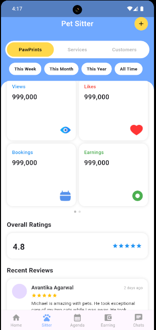
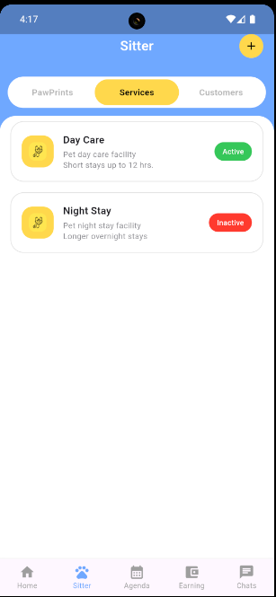
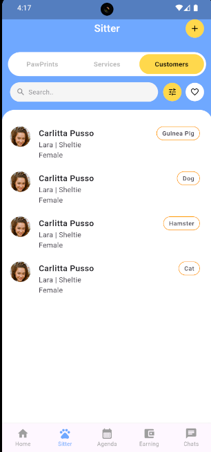

# Pet Sitter App (Flutter UI)

A Flutter-based Pet Sitter application UI featuring PawPrints dashboard, Services management, and Customers listing.  
This project focuses on clean UI, proper spacing, and pixel-accurate design.

---

## 📱 Screenshots

### 🐾 PawPrints


### 🛎 Services


### 👥 Customers


---

## 🛠 Tech Stack
- Flutter
- Dart

---

## ✨ Features
- Custom top tabs (PawPrints / Services / Customers)
- Conditional UI rendering per tab
- Reusable widgets
- Clean folder structure
- Pixel-accurate UI

---

## 🚀 Getting Started

```bash
flutter pub get
flutter run
